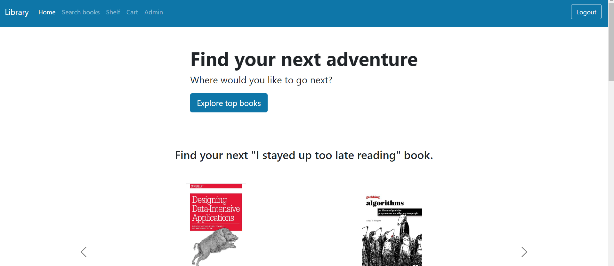
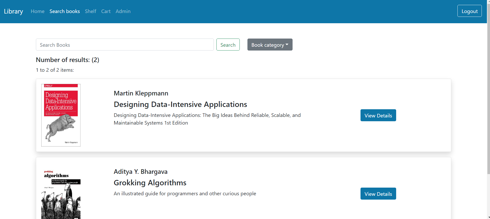
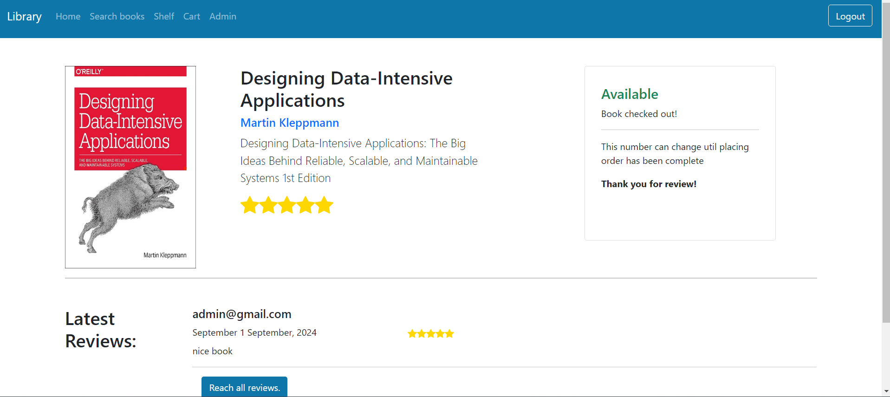
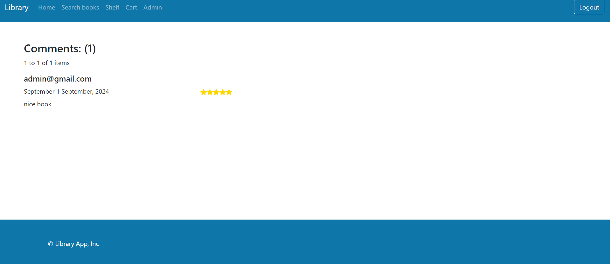
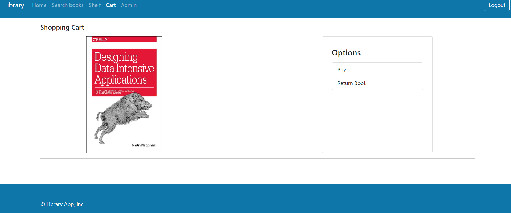
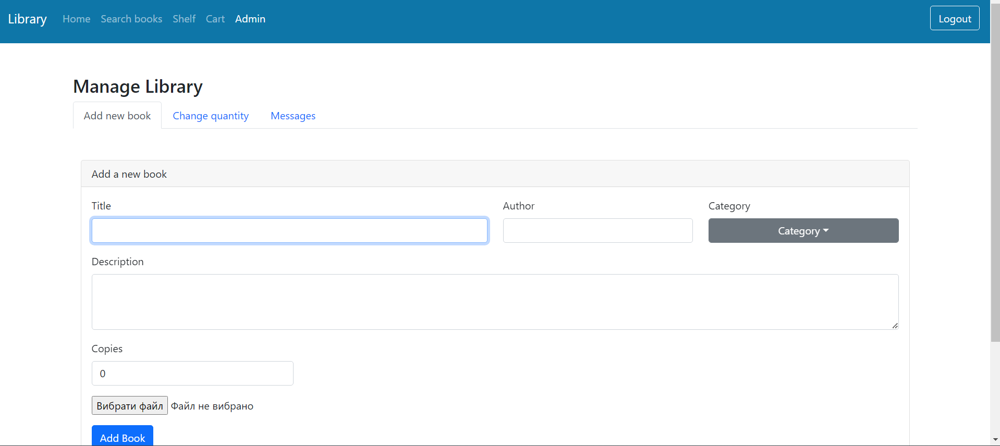

# Library App

### Overview
Library application where you can buy books, leave a review of a book or ask the administrator a question. The administrator can add a new book, delete or change the number of existing ones or answer users' questions.

ATTENTION: the payment service and the library are in test mode.

The frontend is developed using React and the [backend](https://github.com/StudentPP1/library-website-backend.git) is developed using Spring Boot.

### How to Run Application
   The project is hosted on [render.com](https://render.com/), so it is available at the [link](library-website-0nmo.onrender.com)

   

### Snapshot of Application

